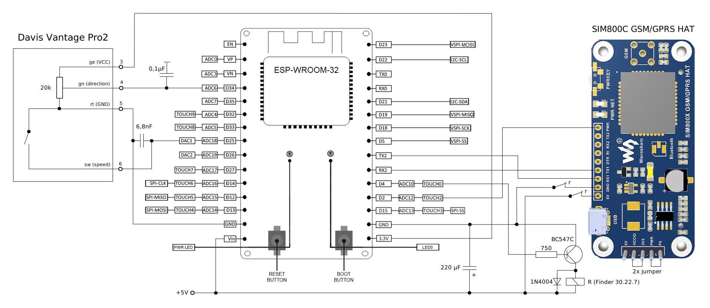

# windsensor

This wind sensor consists of the following hardware components:

* Davis Vantage Pro 2 anemometer and direction vane
* ESP32 Microcontroller
* Waveshare SIM800C GSM/GPRS HAT

The sensor evaluates the wind speed (pulses of the anemometer) and direction (heading of the vane) every second and stored them for later delivery. Every minute, the collected data get sent to a service on the internet.

## schematic

## Output message format

The collected wind data get sent to a service evry minute in the following format:

    {
        version:"1.0.0",
        sequenceId:102,
        anemometerPulses:[0,1,4,2,1],
        directionVaneValues:[32,38,35,38,39]
    } 
    
|property|type|range|description|
|--------|----|-----|-----------|
|version|string|"1.0.0"|The message format version|
|sequenceId|integer|0 <= id <= 999|This property gets used to identify duplicates and out of order received messages. It gets incremented for each new message and wraps around ( ..., 998, 999, 0, 1, ...).|
|anemometerPulses|array of integers|0 <= pulses <= 255|Each value in the array defines the number of anemometer pulses countered within one second|
|directionVaneValues|array of integers|0 <= direction <= 4095|Each value in the array defines the directionthe vane was pointing to. 0 stands for 0° (north), 1024 for 90° (east), 2048 for 190° (south) and 3072 for 270° (west).|

## building and upload
getting started: https://docs.espressif.com/projects/esp-idf/en/latest/esp32/get-started/index.html#get-started-configure
build system: https://docs.espressif.com/projects/esp-idf/en/latest/esp32/api-guides/build-system.html?highlight=idf_component_register#adding-conditional-configuration