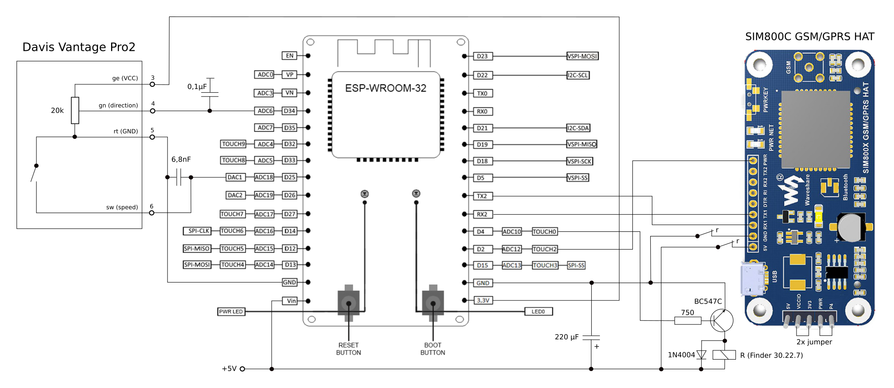

# windsensor

This wind sensor consists of the following hardware components:

* Davis Vantage Pro 2 anemometer and direction vane
* ESP32 Microcontroller
* Waveshare SIM800C GSM/GPRS HAT
* Mean Well RS-25-5 AC/DC power supply, 5A 25W 5V/DC
* optional: Finder print relay 30.22.7 5V

The sensor evaluates the wind speed (pulses of the anemometer) and direction (heading of the vane) every second and stored them for later delivery. Every minute, the collected data get sent to a service on the internet.

## schematic

## Output message format

The collected wind data get sent to a service every minute in messages like the following one:

    {
    	"version":"2.0.0",
    	"sequenceId":60,
    	"messages":[
    		{
    			"anemometerPulses":[0,1,4,2,1],
    			"directionVaneValues":[32,38,35,38,39],
    			"secondsSincePreviousMessage":0
    		},
    		{
    			"anemometerPulses":[6,7,6,5],
    			"directionVaneValues":[800,920,880,1200],
    			"secondsSincePreviousMessage":62
    		}
    	],
    	"errors":["GSM_MODULE_DID_NOT_REGISTER","HTTP_RESPONSE_CODE_404"]
    }

### Envelope format

This section describes the properties of the envelope.

|property|type|range|description|
|--------|----|-----|-----------|
|version|string|"2.0.0"|The message format version|
|sequenceId|integer|0 <= id <= 999|This property gets used to identify duplicates and out of order received messages. It gets incremented for each new message and wraps around ( ..., 998, 999, 0, 1, ...).|
|messages|array of message objects||Each message object (see message format description) in the array contains the measured values of a measurement cycle. Typically this array contains only one message. More than one message can be added to deliver those that failed to delivered in the past (e.g. because of network issues). In such a case the first message in the array is the oldest and the last message is the newest.
|errors|array of strings||Data delivery errors recorded by the sensor. The sensor records the reasons and resets them as soon as delivery succeeded.|

### Message format

This section describes the properties of a message.

|property|type|range|description|
|--------|----|-----|-----------|
|anemometerPulses|array of integers|0 <= pulses <= 255|Each value in the array defines the number of anemometer pulses counted within one second|
|directionVaneValues|array of integers|0 <= direction <= 4095|Each value in the array defines the direction the vane was pointing to. 0 stands for 0° (north), 1024 for 90° (east), 2048 for 190° (south) and 3072 for 270° (west).|
|secondsSincePreviousMessage|integer| seconds >= 0|The number of seconds passed since the previous message was sent. Set it to 0 when the messages property of the envelope contains only one message. This value enables the receiver of this message to store the message with the corresponding timestamp.

## building and upload/flash

To build and upload the software to  the ESP32 the following steps are necessary:

1. connect your ESP32 via USB to your computer
2. adapt the paths used in `startDevEnvInDocker.sh`
3. start the ESP32 development environment executing `startDevEnvInDocker.sh`
4. call `idf.py menuconfig`
5. navigate to "Component config > windsensor > URL of the service" and set the URL
6. save the configuration
7. call `idf.py flash`

## references
[windsensor-service](https://github.com/tederer/windsensor-service)

[ESP32 (getting started)](https://docs.espressif.com/projects/esp-idf/en/latest/esp32/get-started/index.html#get-started-configure)

[ESP32 (build system)](https://docs.espressif.com/projects/esp-idf/en/latest/esp32/api-guides/build-system.html?highlight=idf_component_register#adding-conditional-configuration)